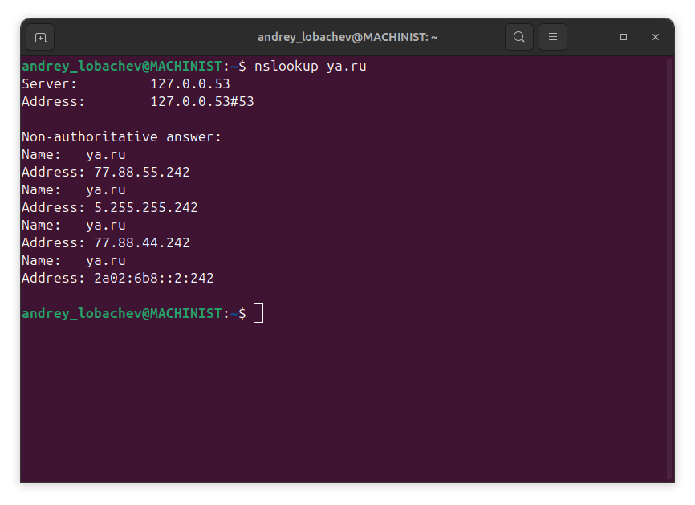
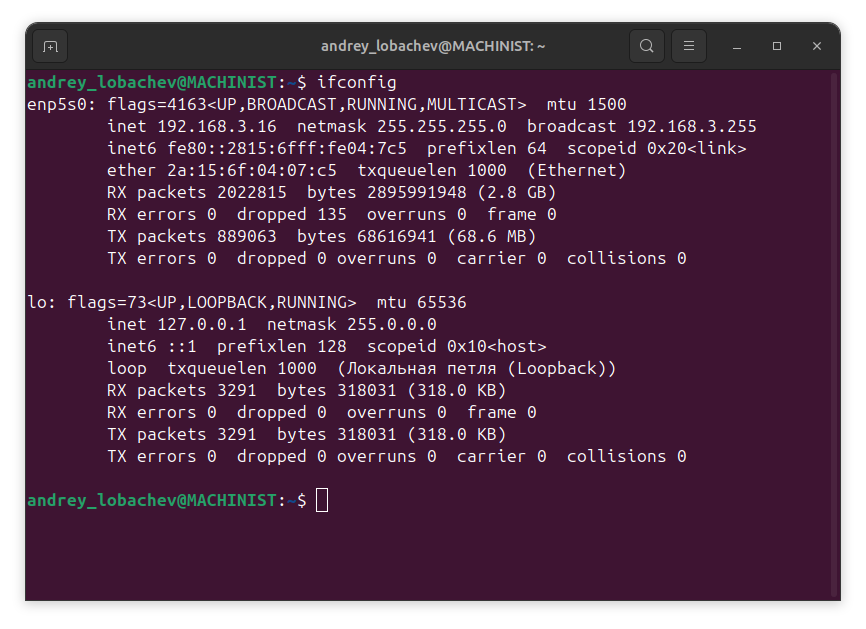
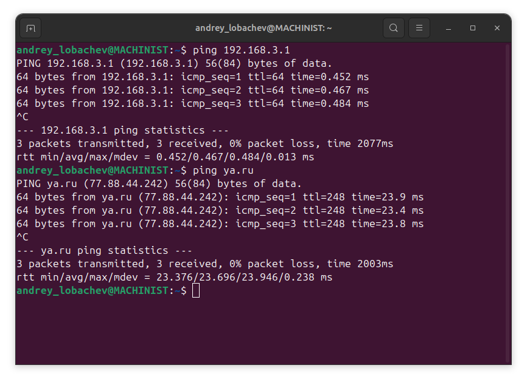
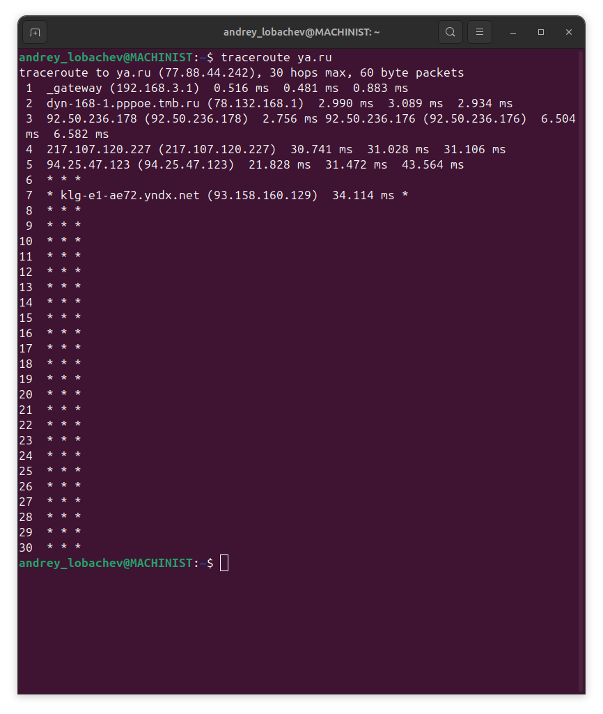

# DevSecOps_Homework_1
## Задание 1: Преобразование доменного имени в IP-адрес

При помощи команды nslookup определён IP V4 адрес ресурса ya.ru - 77.88.44.242 и IP V6 адрес - 2a02:6b8::2:242
 
 ## Задание 2: Использование команд для диагностики сети

Результат исполнения команды ifconfig

Результат исполнения команды ping. Проверена доступность роутера и ресурса ya.ru

Результат исполнения команды traceroute и определения пути до сайта ya.ru

## Задание 3: Процесс установления соединения с использованием TCP

Когда вы вводите URL-адрес сайта в браузере и нажимаете Enter, происходи взаимодействие между различными системами и протоколами для того, чтобы открыть нужную страницу. 

### 1. Ввод URL

Пользователь вводит адрес сайта в строку браузера. Браузеру нужно преобразовать этот домен в IP-адрес, чтобы установить соединение с сервером.

### 2. Разрешение имени через DNS

DNS (Domain Name System) – система доменных имен, которая отвечает за преобразование доменного имени. Может включать несколько шагов:

#### 2.1. Запрос к локальному кэш-памяти DNS

Браузеры хранят результаты предыдущих запросов к DNS в своей локальной памяти. Если ранее уже был запрос к этому домену, браузер может использовать сохраненный IP-адрес без обращения к внешним серверам.

#### 2.2. Запрос к DNS-серверу

Если нужного адреса нет в кэше, браузер отправляет запрос к DNS-серверу интернет-провайдера. .

#### 2.3. Получение IP-адреса

После всех этих DNS сервер возвращает IP вашему браузеру.

### 3. Установление TCP-соединения

Теперь, когда браузер знает IP-адрес сервера, он начинает устанавливать TCP-соединение. Это делается с помощью процесса, известного как тройное рукопожатие:

1. SYN: Клиент отправляет пакет с флагом SYN (Synchronize), сообщая серверу, что хочет начать передачу данных.
   
2. SYN-ACK: Сервер отвечает пакетом с флагами SYN и ACK (Acknowledgment), подтверждая получение пакета клиента и предлагая начать обмен данными.

3. ACK: Клиент подтверждает получение пакета от сервера, отправляя ответный пакет с установленным флагом ACK.

Таким образом устанавливается TCP-соединение между клиентом и сервером.

### 4. Отправка HTTP/HTTPS-запроса

Как только TCP-сессия установлена, клиент отправляет HTTP-запрос на сервер. Например, если используется HTTPS, то сначала будет установлен защищённый канал связи с использованием протокола TLS (Transport Layer Security):

1. Обмен ключами и проверка сертификатов.
2. Шифрование данных с использованием сессионного ключа.

Затем отправляется сам HTTP-запрос, содержащий метод (обычно GET, POST, PUT и др.), заголовки и тело сообщения.

### 5. Ответ сервера

Сервер обрабатывает полученный запрос и формирует ответ. Он может включать код состояния (например, 200 OK, 404 Not Found), заголовки, а также само содержимое страницы (HTML, CSS, JavaScript и другие ресурсы).

Ответ передается обратно клиенту через установленное TCP-соединение.

### 6. Отображение страницы

Получив ответ от сервера, браузер анализирует HTML-документ, загружает все необходимые ресурсы (CSS, JS, изображения и т.д.) и отображает их на экране пользователя.

## Задание 4: Работа с IP-адресами в разных классах
IP-адрес 172.16.5.10 относится к классу B. К классу B относятся IP-адреса, начинающиеся на 128-191.

[Geek University](https://geek-university.com/ip-address-classes/ "Geek University - IP address classes")

[Sys Lab](https://www.syslab.ru/ipcalculator "Sys Lab IP калькулятор")